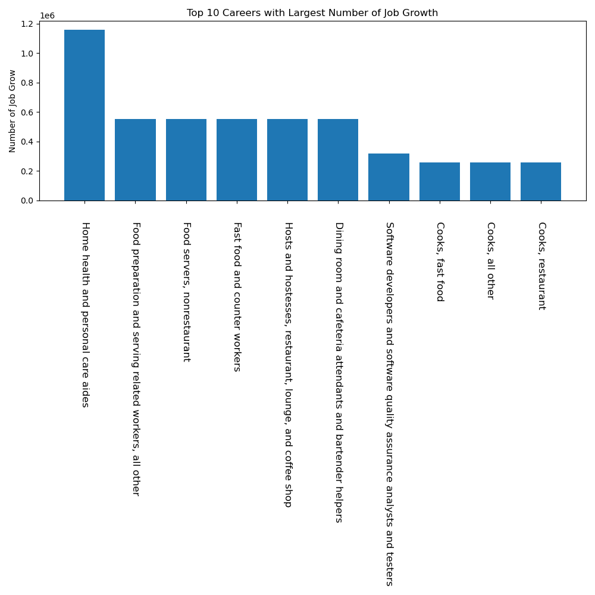
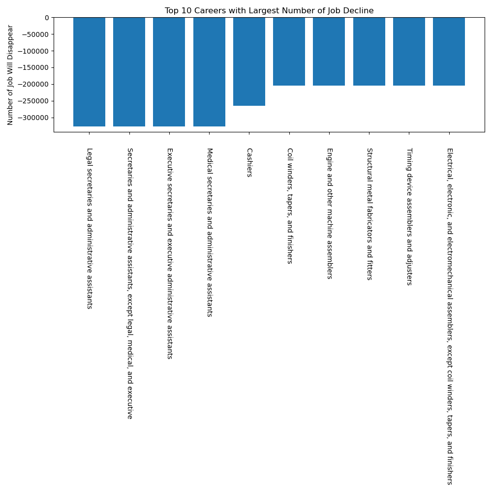
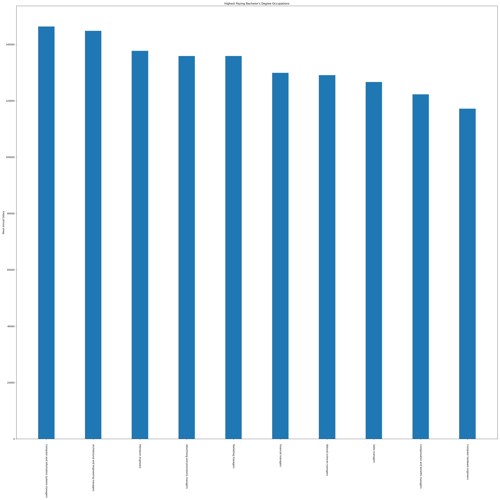
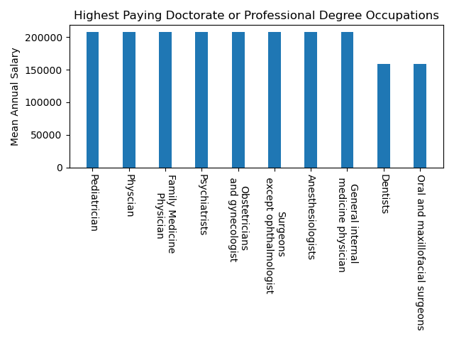

---
output:
  pdf_document: default
  html_document: default
---

# Growing Careers and Majors in the Upcoming Decades 

## Authors:
- Aaron Liu
- Dylan Soh
- David Kim

## Research Questions:

### What are the fastest growing and declining occupations in the next coming years?
- The percentage growth of all occupations/ majors statistically predict the ongoing changes in the job market for the next upcoming decade. Thus, one should figure out the benchmark/ foundation for finding out what prospects will be available in the next few years.
- The fasting growing occupations include jobs in fields such as health, software programming and renewable energy. The fastest declining occupation are mostly works that can be replaced by machines such as secretaries, and machine assemblers. 

### What are the highest paying careers for each educational level ?
- The projection of growing careers and majors reflect the demand from the real world. For different educational levels, we want to understand what are the jobs that provide the best salaries. 
- Whether it be a Bachelor’s, Master’s, Doctorate, or Professional Degree, the highest paying careers are either a computer-related occupation or a healthcare-related field, with some small exceptions.

### What are the average salaries for different levels of education ?
- Degrees have some role in landing a job in a certain career. Of course, not all degrees are treated equally. We want to see if it actually correlates to getting a decent entry level job or making a decent medium salary.
- The level of education with the highest mean annual salary is doctoral or professional degree and the lowest is some college, no degree.

### What majors at the UW have the highest/lowest future earnings ?
- Graduating with a degree in a certain major has a significant impact on how much one can earn at his or her first job to later mid-level jobs regarding skills learned in that major. Thus, it is essential to know if it is likely that a major can give a headstart on one’s first job.
- Of the three highest-salary majors, they’re the Chemical Engineering, Computer Engineering, and Electrical Engineering Major. Of the three lowest-salary majors, they’re the Social Welfare, Art, and Dance Major.

## Motivation and Background:

*Once in a while, every undergraduate student wonders if the work they are doing is worth the time they are spending each day. Is my major going to land me a good paying job ? What major should I choose ? This project attempts to answer these questions with strong evidence. We want to utilize the skills that we learned in 163 to create an informative presentation that taggle these prompts. Also, we are exploring the different career options that we are interested in, and what are the statistics around the career*

## Datasets:

[Payscale](https://www.payscale.com/college-salary-report/majors-that-pay-you-back/bachelors)

*This dataset contains the college salary report for all majors with a bachelor’s degree. It describes and details the medium pay ranging from early to mid-career, alongside its meaningfulness score (determines the likelihood of those enjoying their job roles)*

[BLS](https://www.bls.gov/ooh/occupation-finder.htm?pay=&education=&training=&newjobs=&growth=&submit=GO)

*This BLS dataset is the handbook of all career occupations and their current status in the year 2020. It has described each degree’s prospect in obtaining a certain salary and the chances of landing a job in the next decade’s market*

## Methodology (algorithm or analysis):

1. Scraping data:
    - For the BLS dataset, the data provided is in a more qualitative format. For example, in the “Projected Growth Rate” feature, the values are “as fast as average”, “faster than average”, “little or no change”, etc. Quantitative data can be found by following the links to the individual occupation description pages provided in the “Occupation” feature. We will create a scraping program that follows each link, since there are too many entries for this to be done manually. The program will then read the data from each individual occupation description page and compile that data into a new dataset. This new dataset will have the same features as the original dataset, but with more quantitative rather than qualitative values.

2. Cleaning up data:
    - For the URL Payscale dataset, we need to turn it into a document in Excel that can later be transferred as a CSV file in Python. 
    - At the same time, we need to make sure that all the scraped data for the BLS dataset is successfully combined with the original dataset and is capable of being transferred into a Python CSV file.
    - Once both of these tasks are accomplished, we need to ensure that both of these files are read by the code for the next step in data analysis.

3. Data Wrangling:
    - After we have both CSV files, we will perform some data wrangling. For the Payscale dataset, ranking the major according to different values such as early career pay, mid-career pay and meaningfulness of the work. Select the top majors that have 
    the highest score in each category and compare the data with the BLS dataset.  
    - For the BLS dataset, rank the jobs according to ‘projected growth rate’ and ‘projected number of new jobs’. This is to find out what are the fasting growing careers. 
    - After having both datasets, we will start answering the analysis questions utilizing all the information we gather from the datasets.
4. Analysis & Visualization*:
    - Starting with research question 1, we will have to use the scraped ‘job outlook’ percentages and ‘employment change’ to categorize the occupations with the fastest growth rates and the fastest decay rates.
    - Starting with research question 1, we will have to use the scraped ‘job outlook’ percentages and ‘employment change’ to categorize the occupations with the fastest growth rates and the fastest decay rates.
    - We will then order the ‘employment outlook’ numbers from highest to lowest in a new series to compare it with the ‘job outlook’ one to determine an occupation’s overall rank in growth rates.
    - Finally, we will then create and determine a series detailing the top ten fastest growing occupations based on the gathered data series. At the same time, we will obtain a series with the top ten fastest declining occupations. We will elaborate on both of these by creating two bar charts of how the rates differ among them.
    - For research question 2, we will organize the BLS dataset into separate categories of ‘entry-level education’ with their respective information.
    - We will use the scraped data of the ‘2019 median pay’ for each occupation in each category of ‘entry-level education’ to deduce the jobs that have the highest pay for each type of degree. We will sort this data by highest pay to lowest pay respectively in a resultant list.
    - Once accomplished, we will label the top 10 jobs for degrees for each type of ‘entry-level education’ degree as the benchmark of our findings for question 2. Like question 1, we will document our results through separate bar charts of the ten for each category of ‘entry-level education’.
    - For question 3,  once all of our data is gathered for each category in ‘entry-level education’, we will need to calculate the statistical averages for all occupations falling in each given type of degree.
    - We need to calculate the mean, median, mode, and standard deviation for each category of degree and label our findings in separate plots in a line plot showing the distribution of salaries.
    - For the final question, using the Payscale dataset, we will rank the ‘early-career pay’ column from the highest salary to the lowest for every major.
    - Next, we will rank the ‘mid-career pay’ column from the highest salary to the lowest for every major.
    - For the two newly created series that we have initialized, each major will be assigned a score based on their salary’s value. A low score number represents a high salary while a high score number represents a low salary.
    - Combining the sum of these score numbers for both datasets will create a merged dataset capable of ranking every major from highest salary to lowest salary based on how low the resultant number will be.
    - Once accomplished, we’ll gather a text file listing all known majors line by line at the University of Washington using the MyPlan student account. We will then program the code to read each line and place them in a list.
    - We will then allow the program to filter out majors in the dataset that are not listed in UW.
    - We will then plot our results on separate bar charts showing the top ten ranked highest salary majors and the top ten ranked lowest salary majors by ‘entry-level’ and  ‘mid-level’ in a clustered bar chart.
    
    3. Presentation:
    - We will gather all of our findings, plots, and results into a brief Powerpoint presentation detailing our answers to the proposed research questions.
    - We will use the combination of captions and pictures (in the form of graphs, tables, etc) alongside animations to enable a uniform ‘flow’ of the presentation.
    - The backgrounds and text fonts must be legible and intriguing to ensure the audience maintains complete focus on our findings while allowing us to understand what needs to be said.
    - We will either practice speaking in front of a live audience in Zoom or record our talks in Zoom recording.
    - A disclaimer must be made in the introduction to ensure that our results should not be used as staunch evidence for choosing an occupation or a major. Rather, they must do more research themselves to make sure that they are on the right track.

## Challenge Goals:

- New Library:
    - We will learn how to use Beautifulsoup for web scraping. The data table we plan on using contains links to more specific information about each occupation so we plan on scraping this data and combining it with the original dataset to perform a better analysis. This additional data contains the median pay per year and hour, the exact number of jobs, the job outlook for the next decade, and the overall employment change. The general idea is to write a python script that requests the webpage data, formats it and filters out anything that is not needed, and then writes that data into the comma-separated format that .csv files use.
    - We believe that our project satisfies this challenge goal as we were able to create a csv file with data collected from hundreds of different web pages.
- Messy Data: 
    - Our dataset in Payscale and BLS is not presented in .csv format to get the career and major data that we need, therefore utilizing this new library will help us to get the dataset for achieving the stats of each occupation in the next few years. For example the dataset from BLS, there are several columns that contain both strings and integers. In order to categorize them into the way we intend to, we need to perform several steps of data wrangling. Also, some columns have rows that contain only integers and other rows contain only strings. How to separate these rows in one column is a challenge we need to solve. Last but not least,  we need to figure out a way to smoothly handle the null values in the datasets.
    - We believe that our project satisfies this challenge goal as we have successfully replaced and differentiated strings and integers in the columns of our proposed datasets. Since the dataset started off with a mixture of words and numbers in the form of a string, we need to separate the numbers needed to find the salary amount and to remove phrases contained in each cell for the occupation and majors columns to clearly show the names of each major or occupation needed for the visualization. This is essential as we need to clean up how the data is presented to us to perform numerical analysis and visualization of our results and to appropriately categorize which occupations and majors are important in our findings for our research questions.

## Work Plan:
1. **Scraping data: 4-5 hours**
2. **Cleaning up data: 2-3 hours**
3. **Data wrangling for research questions: 3-4 hours**
4. **Analysis, visualization: 2-4 hours**
5. **Presentation: 2-4 hours**

For collaboration, we will use a version control system, namely Git and GitHub. David and Aaron will focus on the data scraping for the BLS dataset and Dylan will focus on the data clean up for the Pay Scale dataset.

In the end, we believe that the scraping data part of our project didn’t take as long as previously thought. Instead, we believed that the data wrangling and analysis took more time than what is worth. This is because we had to spend time researching ways to split words and integers from each other as the original dataset gave us a mixture of both in a single string.

## Testing:

Throughout our project, we used testing in the form of both asserts and small datasets. Specifically, we created smaller datasets with pieces from the originals and then used the CSE 163 utils module to assert whether or not the columns analyzed in each of our methods, later transformed into a list,  match the proposed or expected columns in list form.

## Collaboration:

We mainly used mostly online resources to help us find the methods that we need to accomplish our tasks needed to solve the research question and clean the datasets. Mainly, we researched methods in the BeautifulSoup, Matplotlib, numpy, and pandas library that we can use in our analysis and visualization of our findings.

## Results:

- Question 1 Results:

*For the fasting growing occupation, according to the employment change 2019-29,  careers besides the IT industry that will see a huge growth in opportunities are health and food related professions, such as cooks, home health and personal care aides. One of the reasons may be the growing number of elder people as baby boomers are in their mid 70s. Other jobs such as food hosts, and food servers are also in demand. Interestingly, but not surprisingly, IT jobs such as software developers, and analysts are also on a high growing trajectory.*

*For the fasting declining occupation, according to the employment change 2019-29, not surprisingly, they are mostly jobs that can be easily replaced by AI and algorithm based applications. Occupations such as legal secretaries, administrative assistants, and executive secretaries are declining dramatically. One cause can be the amount of work required for ten secretaries to do in the past, now can be done with just one secretary who knows how to operate software applications. Other occupations such as cashier and machine assemblers are also declining rapidly. Since most of these occupations can be replaced by machine with more efficient and longer working hours, in the next 10 years, we expect to see more than two hundred thousand jobs will be lost.*

*Compared to employment change 2019-29, job outlook 2019-29 emphasizes more on the rate of occupation growth within the existing number of jobs. Somes of the occupations with the fastest growing rate are wind turbine service technicians and solar photovoltaic installers. One reason can be the growing public concern for renewable energy and policies that may affect the oil industry. Other occupations that have very high growing rates are health related practitioners such as nurse midwives and nurse anesthetists. One interesting point is the growth rate of mathematicians and statisticians.  They both have a growth rate around 40%, meaning from 2019 to 2029, we expect to see the number of job opportunities for these occupations to increase to 140%. In the world where data is such an important method to understand patterns and make decisions, mathematicians and staticison are undoubtedly in high demand.*

- Question 2 Results:

*As a summary, the occupations that are paid the highest across all educational levels commonly revolve around an area in technology or healthcare. For the Bachelor’s degree, most of the high-paying jobs is a manager position while for Master’s and Doctorate or Professional degree, most of these occupations involve being appointed as a medical doctor or a nurse. This data actually matches the reality of what is currently occurring at the moment. In pandemic times, people are working or operating computers to get tasks accomplished while medical treatment is a clear necessity. There’s also some economic occupations that are currently stated in the visualization. It’s probably because of the current economic downturns that need the attention of economic or financial experts.*

- Question 3 Results:

*At a first glance, nothing about these results stand out. As one would expect, the level of education with the highest mean annual salary is indeed the highest level of education, that being a doctoral or professional degree. However, after close evaluation, there are a couple interesting takeaways.*

*First, the difference between the mean annual salary of a bachelor’s degree and a master’s degree is closer than what we expected. The mean annual salary for a bachelor’s degree is $79,413 and $84,965 for a master’s degree. Considering the opportunity cost of attending graduate school instead of entering the workforce earlier, this may feel like insufficient compensation. However, this isn’t to discourage anyone from pursuing a master’s degree. In many cases, completing a graduate degree gives you the skills required for a more specialized position. While the data says that this more specialized position may not pay that much more, it can compensate in other ways, such as being  a more satisfying and engaging occupation.*

*The second interesting result is that the education level with the lowest mean annual salary is some college, no degree. This probably says more about how BLS categorizes “Typical Entry-Level Education” than it does about the reality of that level of education. Classifying an occupation’s typical entry-level education as “some college, no degree” seems like a misnomer. It seems more accurate to say that the entry-level education of those occupations would also be high school diploma or equivalent.*

- Question 4 Results:

[STEM Class Shrink at UW](https://www.seattletimes.com/seattle-news/as-stem-majors-soar-at-uw-interest-in-humanities-shrinks-a-potentially-costly-loss/)

*According to the dataset in Payscale, by running through all known majors at the UW, the highest paying majors are all STEM fields, the majority of them being related to engineering. On the other hand, the lowest paying majors mostly involve fields in the humanities. The only outlier being “Marine Biology”. Surprisingly, this dataset has enormous consequences on the attendance rates of different majors at the UW and colleges nationwide. As a result of the common belief that a STEM degree is a very prosperous and resilient job to have out there given the recent recessions in the recent years, UW has seen a major boom in undergraduates attending STEM degrees. This is completely evident based on our bar plot shown above. Unfortunately, the cost of earning a STEM degree is more expensive than a non-STEM one. This has disrupted the UW’s main goal of keeping college credit as low as possible. Since a STEM degree requires expensive, high-tech equipment, college credit has to increase in order to compensate for the growth in STEM. This is probably one of the reasons for why colleges here at the UW and nationwide are getting more and more expensive over time.*

